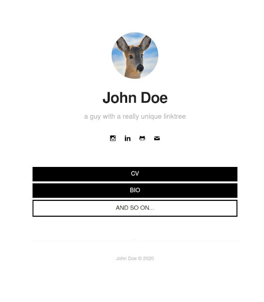

## Indigo-based Minimalist Jekyll Template

#### Modified from the original for use as a social media link tree.

I created this is an alternative to paid-for link services and to build something I can manage using familiar workflows. Oh, and it doesn't hurt that it's open source. Enjoy. -zd

[Demo](https://zchef2k.github.io/indigo-linkinbio)



## What's inside

- [Jekyll](https://jekyllrb.com/) . [Sass](https://sass-lang.com/) . [RSCSS](https://rscss.io/) . [SVG](https://www.w3.org/Graphics/SVG/)
- No JS!
- Trimmed down version of [indigo](https://github.com/sergiokopplin/indigo) with several components and plugins removed.

## Setup

1. Fork the project [indigo-linkinbio](https://github.com/zchef2k/indigo-linkinbio/fork).
2. Edit `_config.yml` with your data.
3. See the example post. The "tag" will be used as the href value, the excerpt for the link text.
4. Customize 'a.button' in general.sass (or any other style, for that matter) to make it yours.

If you want to test locally on your machine, perform the following:

1. Read and follow [these](https://docs.github.com/en/github/working-with-github-pages/testing-your-github-pages-site-locally-with-jekyll) instructions.
2. Clone the forked repo on your machine.
3. Enter the cloned folder via terminal and run `bundle install`.
4. Then run `bundle exec jekyll serve --config _config.yml,_config-dev.yml`.
5. Open it in your browser: `http://localhost:4000`.

## Settings

You must fill some informations on `_config.yml` to customize your site.

```
name: John Doe
bio: 'A Man who travels the world eating noodles and posts about it on social media'
picture: 'assets/images/profile.jpg'
...
```

## Original License

[MIT](https://kopplin.mit-license.org/) License © Sérgio Kopplin
